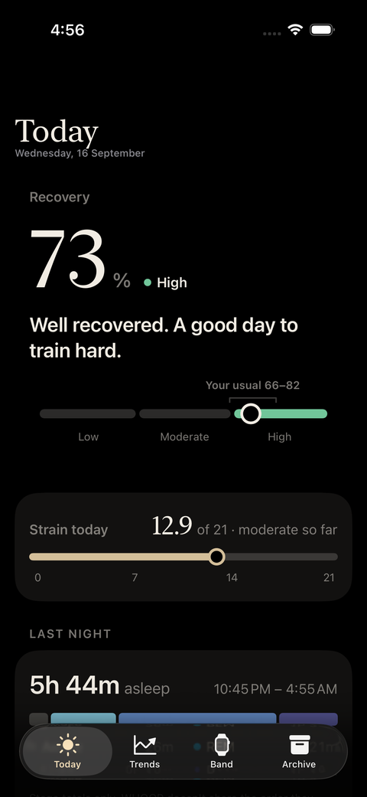
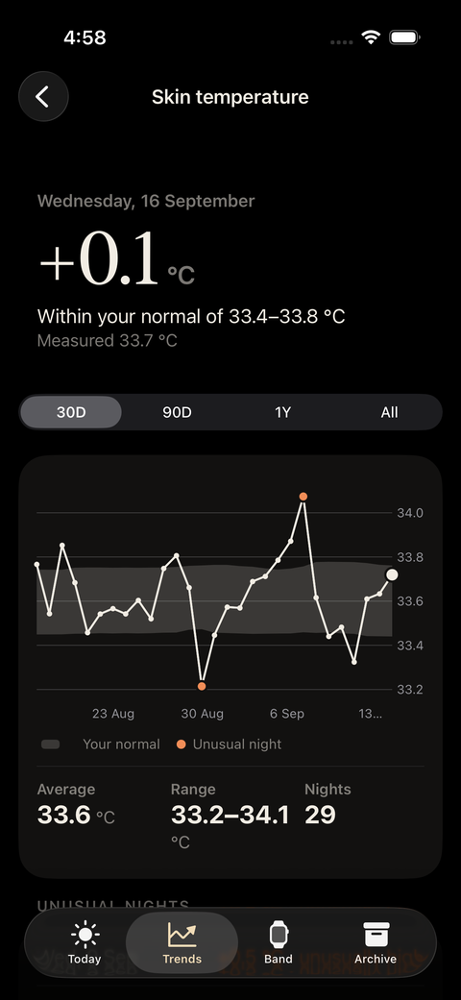
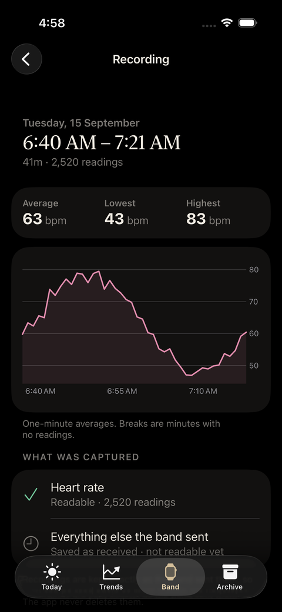
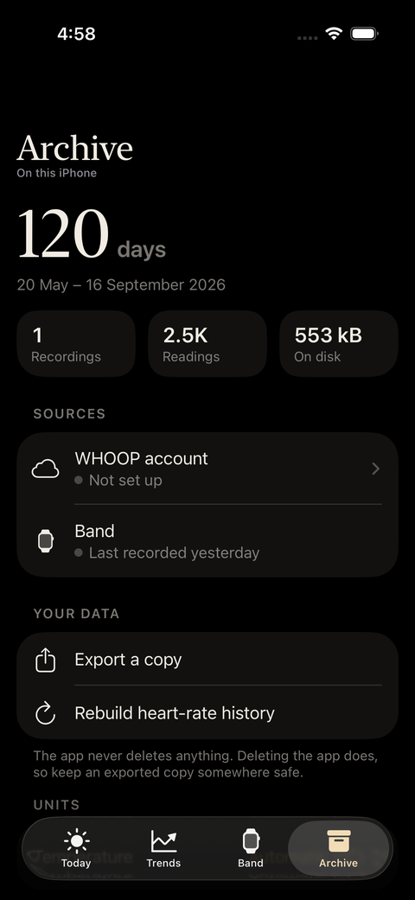

<h1 align="center">ReflexWhoop</h1>

<p align="center">
  Your WHOOP data, kept on your iPhone — measured against your own normal,<br>
  recorded straight from the band, and still there if your membership ends.
</p>

<p align="center">
  
  
  
  
  
</p>

<p align="center">
  
  
  
  
</p>

<p align="center"><sub>Sample data, generated by <a href="scripts/sample_data.py"><code>scripts/sample_data.py</code></a> — not anyone's real readings.</sub></p>

> **Unofficial.** Not affiliated with, endorsed by or supported by WHOOP. The band's
> Bluetooth protocol is reverse-engineered. Not a medical device; nothing it shows is
> medical advice.

---

## Why

The WHOOP app shows you a score. It doesn't hand you the history behind it, the
normal range a number sits in, or anything you can query yourself — and it all lives
on someone else's server, on a subscription.

ReflexWhoop keeps the data on the phone instead. It pulls your history from the WHOOP
API, records live heart rate straight from a WHOOP 5.0 band over read-only Bluetooth,
and stores both in a SQLite archive it never deletes. If the membership lapses, the
archive, the trends and the export still work.

## What it does

| | |
|---|---|
| **Today** | Recovery with a one-sentence verdict, strain on WHOOP's 0–21 scale, last night's sleep, and overnight vitals — HRV, resting heart rate, breathing rate, skin temperature, blood oxygen — each against your 60-day normal. |
| **Trends** | Every metric over 30 days, 90 days, a year or all of it. **Patterns** tests which habits track next-morning recovery, corrected for multiple comparisons and honest about "not enough data yet". **Unusual days** lists readings 2 SD or more from normal, and flags nights when several signals move together. |
| **Band** | Live heart rate from the band and past recordings, kept going in the background with **Keep recording**. |
| **Archive** | What the phone holds, how each source is doing, export (CSV, a SQLite snapshot, raw payloads), and °C or °F. |
| **Your Mac** | An MCP server over an exported snapshot, so Claude can answer questions about your own physiology. |

## What it won't do

- **Touch your band.** Every Bluetooth command passes a compile-time allowlist of
  read-only and live-stream opcodes. Anything that reads or moves the band's stored
  history, sets its clock or reboots it can't be sent, and history packets are never
  acknowledged. → [safety rails](docs/PROTOCOL-GEN5.md#safety-rails)
- **Send your data anywhere.** The only host the app talks to is WHOOP's API. No
  server of its own, no analytics. Data leaves when you export it.
- **Hold your credentials in the open.** You bring your own WHOOP developer app; its
  client ID and secret, and your tokens, live in the Keychain, never in the binary or
  this repository.
- **Make a number up.** A missing reading shows as missing. Charts break at gaps.
- **Throw history away.** No code path deletes collected data, in any build.

## Setup

**Requirements:** a Mac with Xcode 26+, an iPhone on iOS 26+, and an Apple ID signed
into Xcode (a free one works; its installs expire after 7 days, and reinstalling
loses nothing). For WHOOP data, an active membership. For live heart rate, a WHOOP 5.0
band already paired with the official app on the same iPhone.

<details open>
<summary><b>1. Create a WHOOP developer app</b></summary>

At [developer.whoop.com](https://developer.whoop.com), create an app with:

- redirect URI `reflexwhoop://oauth/callback`
- all six scopes: `read:profile`, `read:body_measurement`, `read:cycles`,
  `read:recovery`, `read:sleep`, `read:workout`

Keep the client ID and secret for step 3.
</details>

<details open>
<summary><b>2. Build and install</b></summary>

```bash
git clone https://github.com/Jayanth-reflex/reflex-whoop.git
cd reflex-whoop
cat > Config/Signing.local.xcconfig <<'EOF'
DEVELOPMENT_TEAM = YOUR_TEAM_ID
REFLEXWHOOP_BUNDLE_ID = com.yourname.reflexwhoop
EOF
open ReflexWhoop.xcodeproj
```

`Signing.local.xcconfig` is git-ignored, so your team never ends up in a commit. Your
team ID is in Xcode → Settings → Accounts; the bundle ID just has to be one no other
team uses. Pick your iPhone and press Run. The first install also needs one manual
step on the phone: Settings → General → VPN & Device Management → trust your Apple ID.
</details>

<details open>
<summary><b>3. Connect your sources</b></summary>

The first-run flow asks which to use. For WHOOP, paste the client ID and secret and
sign in; the app brings in your full history. For the band, allow Bluetooth and turn
on Keep recording. Either can be skipped and added later in Archive.
</details>

<details>
<summary><b>4. Optional: let Claude query your data</b></summary>

Export a copy from Archive, then point the MCP server at the snapshot — it opens the
database read-only. Setup in [mcp-server/README.md](mcp-server/README.md).
</details>

## Development

```bash
ruby scripts/generate_project.rb     # after adding or removing any file
xcodebuild test -project ReflexWhoop.xcodeproj -scheme ReflexWhoop \
  -destination 'platform=iOS Simulator,name=iPhone 17'
```

Swift, SwiftUI, Swift Charts and [GRDB](https://github.com/groue/GRDB.swift), with no
other app dependencies. `scripts/sample_data.py` fills a simulator with synthetic
data, so you can work on a screen without putting real readings on it.

On a free Apple ID a build stops launching after seven days.
`scripts/install_refresh_agent.sh` adds a launchd agent that checks daily and, once the
build is five days old, rebuilds and reinstalls it — an upgrade install, so the archive
survives, and it's copied off the phone first regardless.

**Start here:** [AGENTS.md](AGENTS.md) — the commands, the rules that must never
break, and the conventions the code follows. Claude Code reads it through `CLAUDE.md`.

| Doc | What's in it |
|---|---|
| [AGENTS.md](AGENTS.md) | contributor and agent guide: commands, invariants, conventions |
| [docs/ARCHITECTURE.md](docs/ARCHITECTURE.md) | sources, storage, sync, analysis, export, platform limits |
| [docs/PROTOCOL-GEN5.md](docs/PROTOCOL-GEN5.md) | the band's Bluetooth protocol, safety rails, what's confirmed |
| [docs/DESIGN-SYSTEM.md](docs/DESIGN-SYSTEM.md) | colour, type, components, screens, copy rules |
| [docs/DECISIONS.md](docs/DECISIONS.md) | non-obvious choices and the reasoning |
| [docs/ADR-001-data-sovereignty.md](docs/ADR-001-data-sovereignty.md) | why the archive is source-neutral |

## Status

**Working:** WHOOP sync (backfill, retroactive re-scoring, background refresh),
baselines and z-scores, unusual days and illness flags, corrected correlations, live
heart rate from the band, export, and the MCP server.

**Not yet:**

| | |
|---|---|
| Only heart rate is decoded from the band | Beat-to-beat intervals, optical and motion records aren't mapped, so there's no HRV or breathing rate from the band. → [what's confirmed](docs/PROTOCOL-GEN5.md#packet-types) |
| Readiness is hidden | The app's own readiness score leans on WHOOP's capped sleep-debt figure, so it stays off-screen. → [why](docs/DECISIONS.md#readiness-hidden-until-sleep-debt-is-rebuilt) |
| No widgets, iCloud or HealthKit | They need capabilities a free Apple ID doesn't grant. |
| Background recording can be cut short | iOS suspends and terminates background apps; the recording says so. |
| Firmware can break decoding | The raw bytes are always kept, so a fixed decoder rebuilds the history. |

## Licence

[MIT](LICENSE). WHOOP is a trademark of its owner; this project is not connected to
them.
